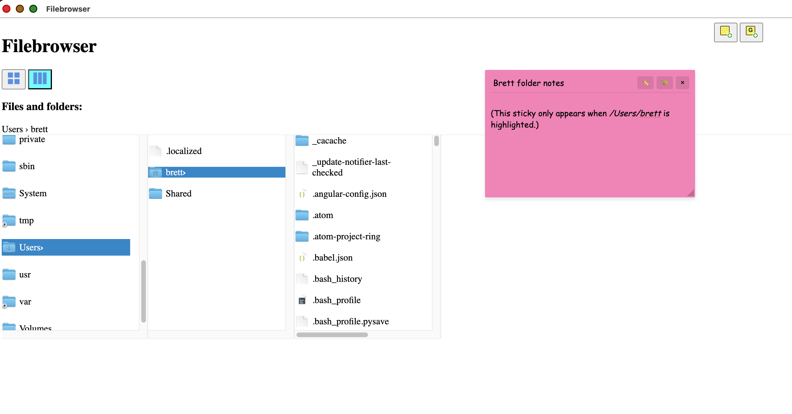

# filebrowser-electron

***ONLY VERY MINIMALLY FUNCTIONAL***

This aims to be a cross-platform and enhanced substitute for the
desktop file browser.



## Install

```bash
npm i filebrowser-electron
cd filebrowser-electron && npm install && npm start
```

## Features

### File Operations
- **Create**: Create new folders and text files
- **Delete**: Delete files and folders with confirmation
- **Rename**: Rename files and folders in place
- **Copy/Move**:
  - Drag-and-drop files/folders (hold **Option/Alt** key to copy instead of move)
  - Drag-and-drop files/folders onto **bash** (.sh) or **JavaScript** (.js, .cjs, .mjs) files to execute them with the dropped item as an argument
  - Keyboard shortcuts: **Cmd+C** to copy, **Cmd+X** to cut, **Cmd+V** to paste
  - Context menu: Right-click on files/folders for Cut, Copy, and Paste options
  - Replace confirmation: When pasting to a location with an existing file/folder of the same name, you'll be prompted to replace or cancel

### Undo/Redo
- **Cmd+Z**: Undo the last file operation (create, delete, rename, move, or copy)
- **Cmd+Shift+Z**: Redo a previously undone operation
- Maintains up to 50 operations in the undo history
- Works across all operation types including:
  - Folder/file creation
  - File/folder deletion (with automatic backup)
  - Rename operations
  - Move/copy operations

### Views
- **Icon View**: Grid-based layout with file icons
- **Three Column View**: Miller columns browser for hierarchical navigation

### Sticky Notes
- Create global and local (folder-specific) sticky notes
- Edit, collapse/expand, and delete notes
- Notes persist across sessions

## Create your own Mac Quick Action

1. Open Automator
1. Create a new Quick Action
1. Set "Workflow receives current" to "files or folders"
1. Find the action "Run Shell Script" and drag it into the Quick Action
1. Change "Pass input" to "as arguments"
1. Paste the following, adapting the filebrowser-electron path to your own
```shell
for f in "$@"
do
	open -a "/Users/brett/filebrowser/out/filebrowser-electron-darwin-arm64/filebrowser-electron.app" --args --path "$f"
done
```
1. Save (e.g., as "Open in Filebrowser")
1. Go to the Finder, choose a folder or file, and right-click it and select "Quick Actions" and your name created in the previous step.

## Invoking with arguments during development

1. Invoke like such: `npm run start -- --path /Users/brett`

## To-dos

1. Clicking column headers (or column checkboxes?) after
    expanding is causing a crash; add tests for currently ignored
    branches if working again
1. Allow icons to be draggable (Sort by None, Sort by Grid) or Sort by Metadata: Name, Kind, Date Last Opened, Date Added, Date Modified, Date Created, Size, Tags)

1. Ideally would allow separate desktops, windows and tabs, with menu bar
    1. At such point, ensure key commands (e.g., copy/cut/paste attached to
        icon table) work globally instead of only when the element (table)
        is focused

1. More Editing Metadata/File
1. Demo with file handler web apps (may need to restore webappfind if
    Chrome apps are now deprecated)
1. Build/set icon:
    <https://stackoverflow.com/questions/31529772/how-to-set-app-icon-for-electron-atom-shell-app>
1. Proper publishing: <https://www.electronjs.org/docs/latest/tutorial/tutorial-publishing-updating>
1. Make extensible
1. Design in such a way that privileged APIs could work if WebExtensions
    allowed overriding browser's `file:///` browser (not only for
    directories, but also to allow injecting a button to allow editing
    browsed files as well)

## Misc. to-dos

1. Allow "Show package contents" context menu for apps
1. Allow column view to start from non-root (as with list and
    other views)
